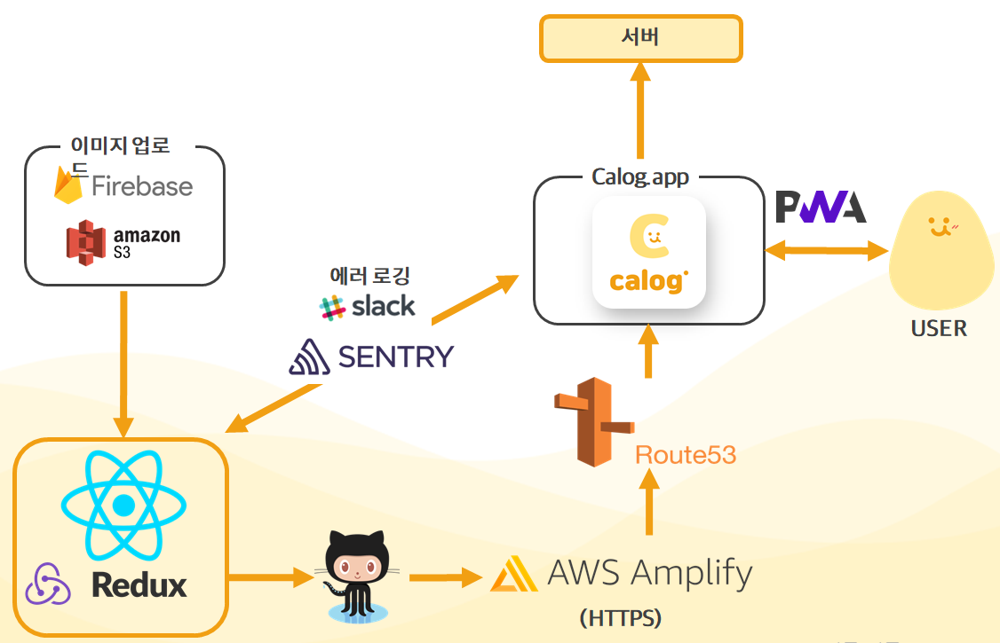
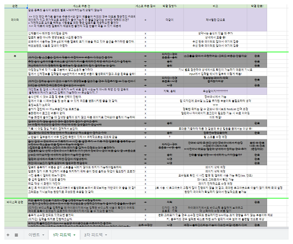

# **Calog** - 내가 먹는 모든 음식의 칼로리가 궁금하다면?


## 🧚‍♀️ 칼로그는?

- 칼로리를 고민하는 사람들을 위해, 편리하게 칼로리 검색과 기록, 계산까지 한번에 할 수 있도록 도와주는 서비스
- 기존의 식단앱에서 느낀 불편한 점들을 개선하고 내가 쓰고싶은 칼로리 프로그램을 만들자 하는 취지에서 만들게 된 서비스 

### FrontEnd members
- 김나영 / 최지혁 / 박용태

🐷[Calog 링크](https://www.calog.app/)

💋[Youtube 링크](https://youtu.be/2TLdSkSYYaM)

📗[Notion 링크]() 예정...

🍕[Backend Repo 링크](https://github.com/dennis9352/Calog-Backend)

🎨[Wireframe 링크](https://www.figma.com/file/KO3PQQwPOBCH9NKsoQFj74/%EC%B9%BC%EB%A1%9C%EB%A6%AC%EC%A6%88-%EB%94%94%EC%9E%90%EC%9D%B8?node-id=1429%3A2272)

<a href="https://ko.reactjs.org/" target="_blank"></a>
<a href="https://javascript.info/" target="_blank"></a>
<a href="https://ko.redux.js.org/" target="_blank"></a>
<a href="https://sentry.io/" target="_blank"></a>
<a href="https://aws.amazon.com/" target="_blank"></a>
<a href="https://firebase.google.com/" target="_blank"></a>
<a href="https://reactrouter.com/" target="_blank"></a>
<a href="https://styled-components.com/" target="_blank"></a>

<a href="https://ko.redux.js.org/" target="_blank"></a>
<a href="https://ko.redux.js.org/" target="_blank"></a>
<a href="https://ko.reactjs.org/" target="_blank"></a>
<a href="https://developer.mozilla.org/ko/docs/Web/Progressive_web_apps/Introduction" target="_blank"></a>

---
<br/>

## 목차
[1. 개요](#개요)

[2. 프로젝트 구조](#프로젝트-구조)

[3. 프로젝트 기능](#프로젝트-기능)

[4. 트러블 슈팅](#트러블-슈팅)

[5. 고객 반응 및 개선](#고객-반응-및-개선)

[6. 기타](#기타)


## 개요

- 프로젝트 이름: **Calog**

- 개발 기간 : 2021년 7월 23일 ~ 2021년 8월 31일

- 개발 언어 : JavaScript

- 개발 라이브러리 : React.js

- 형상 관리 툴 : git

- 협업 툴 : git / Notion / google spreadsheets / figma / slack

- 개발 인원 : 8명
  - **Front end** : **김나영, 최지혁, 박용태**
  - **Back end** : **이경원, 박진홍, 오인웅**
  - **Designer** : **김민경, 이경미**

- 사용 패키지 (설명 추가 및 정리 예정)

  <details>
    <summary>자세히</summary>
    <div markdown="1">
    
    |이름|내용|
    |---|---|
    |react-toastify|토스트 메시지|
    |react-scroll-horizontal|횡스크롤|
    |styled-reset|스타일 전역 관리|
    |axios|REST API 통신|
    |@sentry/react, @sentry/tracing|에러 모니터링|
    |@reduxjs/toolkit|Redux Toolkit|
    |react-lazyload|로드 지연 방지|
    |react-aws-s3|AWS S3 이미지 업로드|
    |browser-image-comporession|이미지 리사이징|
    |react-slick|이미지 캐러셀|
    |react-helmet|검색 최적화|
    |prop-types|타입 고정|
    |lodash|이벤트 중복 발생 방지|
    |react-icons|아이콘|
    |nivo|대시보드 도넛 차트|
    |moment|날짜|
    |styled-components|CSS-in-JS 라이브러리|
    |react-nice-dates|Date Picker|
    |firebase|이미지 업로드|

    </div>
  </details>


## 프로젝트 구조




## 프로젝트 주요 기능

  ### ⓞ 주요 기능
  - 로그인, 회원가입, 소셜로그인
  - 기록 : 바디스펙, daily 칼로리 기록 (사진, 메모), 캘린더
  - 검색 : 칼로리 검색 (필터링, 정렬, 페이징), 최근검색어, 인기검색어
  - 편의 : 즐겨찾기, 카트, 커스텀 식단, 직접등록
  - 기타 : 피드백, 프로필 (닉네임, 사진), 스피너, 반응형
  
  ### ① 로그인, 회원가입, 소셜로그인
  - axios와 axios-interceptors 를 통한 서버와 api 요청
  - csrf 토큰, access 토큰을 이용한 로그인 체크 및 보안성 향상
  - 회원가입 시 이메일, 닉네임 debounce를 통해 서버에 자동 중복 체크
  - 서버에서 passport 모듈을 이용한 소셜 로그인
        
  ### ② 기록
  -  유저가 기록한 데이터는 조금 더 시각적인 요소를 두어 포인트를 빠르게 캐치할 수 있도록 구성하였습니다.
  
    - **대시보드**
     - 대시보드에서는 nivo 그래프를 사용하여 기초대사량 대비 오늘 섭취한 칼로리를 끼니별로 나누어 확인이 가능합니다.
     - nivo 그래프를 사용한 이유 : 초기 chartjs로 그래프를 구현하였으나 nivo의 경우 라벨 등 조금 더 디테일하게 커스텀이 가능하고 이를 코드에 적용하는데 직관적으로 확인이 가능하였기 때문에 선택하게 되었습니다.
     
    - **캘린더**
     - 캘린더에서는 한 달의 기록이라는 많은 데이터를 보여주고 있기 때문에 ux적으로 유저가 많은 데이터를 보기에 한 눈에 캐치할 수 있는 요소를 고민하였습니다.
     - 단순히 기록에 대한 데이터를 보여주는 것이 아닌 기초대사량 대비 적정 %를 기준으로 두어 내가 한 달 동안 올바른 식습관을 가지고 있는지 확인할 수 있도록 아이콘을 통해 구현하였습니다.
     
        <details>
        <summary>아이콘 범위 설정</summary>
        <div markdown="1">
        
        ```javascript
         // 범위
         // +,- 10
         const ten = bmr*0.1;

         // +,- 20
         const twenty = bmr*0.2;

         // case 1) '잘 먹었어요'의 기준(bmr+-10)
         const good = ((bmr-ten) <= kcal) && (kcal <= (bmr+ten));

         // case 2) '적당히 먹었어요'의 기준(bmr+-20)
         const well = ((bmr-twenty) <= kcal && kcal < (bmr-ten)) || ((bmr+ten) < kcal && kcal <= (bmr+twenty));

         // case 3) '너무 적게 또는 많이 먹었어요'의 기준(over)
         const bad = kcal < (bmr-twenty) || (bmr+twenty) < kcal;
        ```
        </div>
        </details>
     
     - 또한, 1차 런칭 후 피드백에서 '기록 단계가 길어서 번거로운 부분이 있다.'의 의견을 수렴하여 기록 단계를 최소화 시키며 기록에서 진행하였던 이미지와 메모의 기록이 캘린더 특정 날짜에서 가능하게 되었습니다.
     - 이미지 업로드 시 미리보기 확인이 가능하며, 이미지의 용량이 클 경우 화면에 표출되는데 로딩이 걸려 **browser-image-compression**를 통해 리사이징 후 업로드를 진행하고 있습니다.
     

  ### ③ 검색
  > 검색 기능은 Calog의 메인 기능입니다. 유저가 필수적으로 사용해야 하는 기능인만큼 **직관적인 뷰, 타이핑과 클릭을 최소화**하여 **사용성**을 높이는데 초점을 맞춰서 개발했습니다.**최근검색어**와 **인기검색어**기능은 이 점을 극대화하기 위하여 부가적으로 구현한 기능입니다.

  - **칼로리 검색** 
    - keyword에 해당하는 결과값을 받아오는 기능. 무한스크롤이나 페이지네이션처럼 데이터를 끊어서 받아오지 않고 첫 검색에 한번에 해당하는 모든 데이터를 받아왔습니다.
    - 후술할 필터링과 정렬기능을 서버요청없이 프론트에서 구현하기 위해 원본을 담는  `list`와 가공된 데이터를 담는 `filtered_list`, 두 개의 initialState 를 만들어 검색결과를 프론트에서 가공하여 출력하였습니다.

        <details>
        <summary>Range Slider</summary>
        <div markdown="1">
        
        ```javascript
        const initialState = {

          // 검색 결과 리스트 (원본)
          list : [],
          // 정렬 및 필터링된 결과
          filtered_list: [],

        }
        ```
        </div>
        </details>
  
  - **칼로리 정렬**
    - `list`의 원본 값을 칼로리 오름차순, 내림차순, 이름 으로 정렬해 `filtered_list`에 담아 출력하였습니다.

  - **칼로리 필터링**
    - Range Slider 를 직접 구현해, 최소값과 최대값 사이의 값들만 `filter_list`에 담아 출력하였습니다.
        <details>
        <summary>RangeSlider 구현 과정</summary>
        <div markdown="1">
        
        ```javascript
        const [minVal, setMin] = useState(min);
        const [maxVal, setMax] = useState(max);
        const minRef = useRef(min);
        const maxRef = useRef(max);
        const range = useRef();

        // percentage 변환 함수
        const getPercent = useCallback((value) => {
          return Math.round(((value-min) / (max - min)) * 100);
        }, [min, max]);

        // 왼쪽 SliderRange 조절
        useEffect(() => {
          const minPercent = getPercent(minVal);
          const maxPercent = getPercent(maxRef.current);

          if (range.current) {
            range.current.style.left = `${minPercent}%`;
            range.current.style.width = `${maxPercent - minPercent}%`
          }
        }, [minVal, getPercent]);

        // 오른쪽 SliderRange 조절
        useEffect(() => {
          const minPercent = getPercent(minRef.current);
          const maxPercent = getPercent(maxVal);

          if (range.current) {
            range.current.style.width = `${maxPercent - minPercent}%`;
          }
        }, [maxVal, getPercent]);

        // 변화 값 반환
        useEffect(() => {
          onChange({ min: minVal, max: maxVal });
        }, [minVal, maxVal, onChange]);

        // 두개의 thumb 역할을 하는 input 태그와 배경에 해당하는 SliderTrack, 가변요소인 SliderRange 를 활용하여 렌더되는 코드에 위의 요소들을 반영
        // src/componenets 경로의 Main_RangeSlider 컴포넌트에서 확인할 수 있습니다.
        ```
        </div>
        </details>

  - **페이징**
    - 검색결과를 인덱싱하여 20개씩 더해져서 출력하는 기능입니다.
    - 후술할 [트러블 슈팅](#트러블-슈팅)에서 언급할 이슈를 해결하기위해 구현한 기능입니다.
      <details>
      <summary>페이징</summary>
      <div markdown="1">
      
      ```javascript
      // 페이징
      const [page, setPage] = useState({
        start: 0,
        end: 20,
      })
      // 더보기 버튼에 넣어줄 함수
      const nextPage = useCallback(() => {
        setPage({
          start: page.start,
          end: page.end + 20,
        })
      }, [page])
      ```
      </div>
      </details>


  ### ④ 편의
  > 편의 기능은 유저의 타이핑, 클릭을 최소화하고 **지속적**이고 **편리한 이용**을 위해 구현한 기능입니다.

  - **즐겨찾기**
    - 즐겨찾는 음식을 마킹 해놓고 쉰게 다시 찾는 기능으로 유저의 개인데이터에 저장되는 기능입니다.

  - **카트**
    - 현재는 음식담기로 바뀐 기능으로 기록할 음식을 카트에 담고 기록까지 연결하는 기능입니다. 현재는 커스텀 식단 기능이 추가되어 해당 기능으로 연결되는 역할도 병행합니다.
    - 즐겨찾기와 다르게 [redux-persist](#트러블-슈팅)로 구현된 기능입니다. 즐겨찾기처럼 지속적으로 담아놓지 않으며 휘발성이 있고 쉽게 담고 뺄 수 있기 때문에 **sessionStorage**에 저장해 해당 저장소가 비워지는 이벤트가 발생하거나 브라우저가 종료되기 전까지 데이터가 유지됩니다.
    - 해당기능은 프론트에서 운용하기에 적절한 방식(유저 정보지만 비로그인유저도 이용할 수 있고, 특정목적이 있을 때만 사용되는 점)을 갖고있는 점과 서버로의 요청을 줄이고자 하는 목적으로 구현되었습니다.

  - **커스텀 식단**
    - ver.1 런칭 이후 **유저피드백을 반영**해 구현한 기능입니다.
    - 일정한 식사 패턴을 가진 유저를 위해 여러 음식을 원하는 양조절까지 해서 식단으로 만들어 간단한 클릭이나 터치로 음식담기에 담아 사용할 수 있는 기능입니다.
    - 기존의 카트에 사용하는 컴포넌트들을 그대로 재활용해 구현하였습니다.

  - **직접 등록**
    - ver.1 런칭 이후 **유저피드백을 반영**해 구현한 기능입니다.
    - 칼로그 데이터에 등록되지 않은 음식나 유저가 직접 만든 음식 같은 음식데이터를 직접 추가해 기록에 활용할 수 있는 데이터입니다.
    - 유저 개인데이터로 저장되며 본인만 사용할 수 있는 기능입니다.
    - 즐겨찾기나 커스텀식단과 같이 메인화면에서 확인할 수 있습니다.

  ### ⑤ 기타
  - **프로필 사진**
    - 유저의 마이 페이지에서 프로필사진을 추가할 수 있는 기능입니다. 
    - 소셜로그인을 했을 경우 디폴트 값으로 소셜매체의 프로필사진이 들어옵니다.

  - **닉네임 수정 기능**
    - ver.1 런칭 이후 **유저피드백을 반영**해 구현한 기능입니다.
    - 유저의 마이 페이지에서 기존 닉네임을 수정할 수 있는 기능입니다. 
    - 소셜로그인을 했을 경우 디폴트 값으로 소셜매체의 닉네임이 들어옵니다.

  - **피드백 기능**
    - 유저가 Calog를 이용하면서 느낌점이나 개선점, 요구사항 등을 받는 기능입니다.
    - 해당기능은 발빠른 대응을 위해 팀의 협업툴인 Slack으로 전송됩니다.
    - ver.1 런칭 이후 **유저피드백을 반영**해 이미지 등록이 추가된 기능입니다.
    - 이미지 등록은 AWS S3를 통해 버킷에 저장하여 url을 서버로 보내줍니다. 이 때, browser-image-compression 패키지를 이요해 이미지를 리사이징하여 전송합니다.
  
  - **스피너**
    - 서버에서 데이터를 받아오는 비동기 통신 과정에서 생기는 딜레이 과정에서 스피너를 보여줍니다.
    - Calog만의 케릭터를 활용하여 귀엽게 만들었습니다.
    - styled-components의 keyframes를 활용하여 구현하였습니다.
    - 실제로 다수의 유저가 피드백을 통해 호감을 보였던 부분이었습니다.

  - **반응형 UI**
    - 미디어 쿼리를 이용해 iphone5 부터 최신기종 및 각종 태블릿 pc까지 호환가능하도록 구현하였습니다.
    - 뿐만아니라 웹에서도 단순 모바일형 UI가 아닌 프레임 밖에서도 상호작용할 수 있는 기능과 배경이미지를 활용하여 사용성을 높혔습니다.

## 트러블 슈팅

- 변수로 브라우저에 저장되어 있는 토큰을 함수로 가져오게 함으로써 토큰이 없을 때 빈 값을 가져오는 것을 방지함

- debounce 로 닉네임, 이메일 중복체크를 자동으로 서버에 요청하려했으나 닉네임, 이메일 입력 시 생기는 리랜더링으로 인해 입력한 글자 수 만큼 요청이 생겨 debounce 를 닉네임과 이메일 값에도 줌으로써 최종 닉네임과 이메일만 서버에 요청하게 설계

- 서버에 요청받는 데이터들을 초기 변수 설정을 하지 않음으로써 생기는 문제를 데이터 형식에 맞게 기본 값을 줌으로써 

  ### ① 검색결과 클라이언트 과부하 이슈
  - **어떤 문제가 생겼나?**
    - 서버에서 받아오는 검색결과가 600개를 넘어설 때 클라이언트에 과부하가 발생하였음.
  - **해결을 위한 시도**
    - 서버에서 무한스크롤과 페이지네이션으로 데이터를 끊어 받을 것을 요청. 
      👉 기존 정렬 및 필터링 기능까지 서버에서 가져가야하고 그렇게 요청이 너무 많아질 수 있어 섣불리 결정할 수 없었음. (실패)
    - 검색결과를 100개 까지만 출력.
      👉 기존 정렬 및 필터링 기능에는 영향이 없는 방법이지만, 유저가 볼 수 있는 데이터의 갯수를 제한하는 방법이므로 유저의 사용성을 해친다고 판단. (실패)
    - 많은 양의 데이터가 넘어오는 것 자체는 문제가 되지 않지만 그 많은 데이터를 전부 출력했을 때, 클라이언트에 부하가 생김. 그래서 받아온 데이터를 리덕스를 활용해 무한스크롤 구현을 시도
      👉 무한스크롤의 경우 데이터를 앞으로 보내주는 과정이 필요한데, 리덕스 자체만으로 데이터를 호출할 수 없었음. (실패)
    - 데이터를 끊어서 추가로 출력해주는 페이징을 구현
      👉 자체 무한스크롤을 시도하며 사용했던 방법을 이용해 '더보기' 버튼을 누르면 추가로 20개씩 데이터를 더 보여주는 기능을 구현. (성공)
  - **결과**
    - 페이징을 통해 클라이언트의 과부하를 막을 수 있었고, 기존의 필터링 및 정렬 기능을 문제없이 가져갈 수 있었음.

  ### ② Redux-persist 활용
  - **어떤 문제가 생겼나?**
    - 카트 기능은 유저가 가볍게 사용할 수 있고, 기록이라는 메인기능을 준비하는 과정을 담당하는 기능이기 때문에 얼마든지 가공하고 넣었다 뺐다 할 수 있는 기능이어야 했음. 때문에 많은 요청이 서버로 갈 수 있고, 이를 줄이기 위해 서버통신 없이 redux를 활용해 구현하게 된다면 새로고침 같은 이벤트가 있을 때 어렵게 담아놓은 카트가 비워진다는 이슈가 있었음.
  - **해결을 위한 시도**
    - redux에 있는 데이터를 localStorage나 sessionStorage에 반영구적으로 저장하는 redux-persist를 이용해 카트 모듈을 구현.
      <details>
      <summary>Redux-persist</summary>
      <div markdown="1">
      
      ```javascript
      // redux-persist
      import { persistReducer, persistStore } from "redux-persist";
      import storageSession from "redux-persist/lib/storage/session";

      ```

      ```javascript
      // persist
      const persistConfig = {
        key: "auth",
        storage: storageSession,
        whitelist: ["cart", "recent", "record", "dashboard", "food"]
      };

      const reducer = combineReducers({
        user: user.reducer,
        record: record.reducer,
        cart: cart.reducer,
        favorite: favorite.reducer,
        search: search.reducer,
        recent: recent.reducer,
        notice: notice.reducer,
        dashboard: dashboard.reducer,
        food:food.reducer,
        custom: custom.reducer,
        router: connectRouter(history),
      });

      // persist
      const persistedReducer = persistReducer(persistConfig, reducer);
      export const store = configureStore({ reducer: persistedReducer, middleware: middlewares });
      export const persistor = persistStore(store);
      export default { store, persistor };
      ```
      </div>
      </details>

  - **결과**
    - 효율적으로 카트 기능을 운용할 수 있었고, 실제로 유용성이 검증되어 다른 기능 (최근검색어, 기록 등)에도 활용하게 됨.

  ### ③ 이미지 리사이징
  - ☝🏻 문제 : s3에 이미지 업로드 시 용량이 큰 이미지의 경우 스토리지에 적용되는 용량도 많이 차지하고 클라이언트에서 로드 할 때에도 끊어지는 현상이 있었습니다.

  - ✍🏻 적용
   - 미리보기가 로드되기 전까지는 lazy loading을 주었습니다.
   - lambda를 사용하더라도 고해상도의 이미지는 필요가 없기 때문에 'browser-image-compression' 이미지 파일을 패키지를 사용하여 1차 리사이징하였습니다.

  -💡해결

        <details>
        <summary>이미지 리사이징</summary>
        <div markdown="1">
        
        ```javascript
        import LazyLoad from 'react-lazyload';
        ...
        <LazyLoad>
          <component />
        </LazyLoad>

        - browser-image-compression로 이미지 리사이징 후 preview 띄우기(업로드 버튼에도 동일하게 적용)

        import imageCompression from "browser-image-compression";
        ...
        //인풋박스의 onChange 함수
        const chgPreview = async (e) => {
            //원본
            const imageFile = e.target.files[0];
            //아래 사진의 1-2번째 줄
            console.log('originalFile instanceof Blob', imageFile instanceof Blob);
            console.log(`originalFile size ${imageFile.size / 1024 / 1024} MB`);
            //리사이징 옵션
            const options = {
              //최대 크기 (default: Number.POSITIVE_INFINITY)
              maxSizeMB: 1,
              maxWidthOrHeight: 1920,
            }
            //리사이징
            try {
              const compressedFile = await imageCompression(imageFile, options);
              //아래 사진의 3-4번째 줄(파일의 크기가 줄어든 것을 확인할 수 있다.)
              console.log('compressedFile instanceof Blob', compressedFile instanceof Blob); // true
              console.log(`compressedFile size ${compressedFile.size / 1024 / 1024} MB`); 
              //preview에 띄우기 위해 리사이징된 파일의 url생성
              const imageUrl = URL.createObjectURL(compressedFile);
              //useState에 적용해준다.
              setFileUrl(imageUrl)
            } catch (error) {
              window.alert('이미지 업로드에 오류가 있어요! 관리자에게 문의해주세요!')
            }
          }
        ...
        <FileBox type="file" accept="image/*" ref={fileUpload} onChange={chgPreview} id="imgFile"/>
        ```
        </div>
        </details>

    ✔️ s3에 업로드 시 한 번 리사이징을 통해 3MB정도 크기의 이미지를 700-800KB까지 줄일 수 있었습니다.

  ### ④ AWS Amplify
  - 장점 : 배포 과정의 간소화, ssl 인증서 적용 및 custom domain 설정이 간단함, 작업별 테스트 배포 환경이 분리되어있습니다.
  - 실제 적용
    - 앱을 만들어 깃과 연동시키는데 5분도 채 걸리지 않을 정도로 간단하여 시간을 효율적으로 단축시킬 수 있었습니다.
    - ssl 인증서 생성 후 설정, https 설정, custom domain 설정이 간편합니다.
    - 깃 브랜치를 연동시켜놓으면 브랜치별로 각각의 페이지 확인이 가능하여 테스트 배포 환경이 분리됨으로 사이트에 적용되는 코드들을 바로 바로 확인이 가능하였습니다.

  ### ⑤ Sentry - Error Logging
  - 배포를 앞두고 유저들의 사용 중에 발생할지도 모르는 에러를 로깅하고 해결하기 위해 Sentry 를 적용하게 됨.
  - 적용 후 Slack으로 연동해 발생하는 에러들에 발빠르게 찾아내 해결할 수 있었음.
      <details>
      <summary>Sentry</summary>
      <div markdown="1">
      
      ```javascript
      // sentry
      import * as Sentry from '@sentry/react';
      import { Integrations } from '@sentry/tracing';

      // sentry 설정
      Sentry.init({
        // 환경에 상관없이
        dsn: process.env.REACT_APP_SENTRY_DSN,
        integrations: [new Integrations.BrowserTracing()],
        tracesSampleRate: 1.0,
      });

      ```

      
      </div>
      </details>

## 고객 반응 및 개선

> 1차 런칭 이후 5일간 약 50 여 개의 유저 피드백을 받아 기능 및 뷰를 개선하였고 새로운 기능을 추가하였음.

  

  ### 주요 피드백
  - 원하는 데이터가 없을 때 직접 추가하고 싶다.(5건)
  - 매일 같은 다이어트 식단을 먹는데 매번 음식을 일일이 담아서 기록하기 힘들다.(4건)
  - 기록하는 과정이 너무 길고 클릭이 많다.(4건)
  - 그 외 음식데이터 추가 요청 등

  ### 피드백 반영 및 개선
  - 자주먹는 식단을 저장할 수 있는 [식단 커스터마이징](#프로젝트-주요-기능) 기능
  - 사용자가 만들어가는 음식데이터 [직접등록](#프로젝트-주요-기능) 기능
  - [기록기능](#프로젝트-주요-기능) 로직 분리 및 간소화 (칼로리 기록과 사진, 메모의 분리)
  - [피드백 이미지 업로드](#프로젝트-주요-기능)

## 기타


# ✍🏻 프로젝트 소스


# 홈페이지


